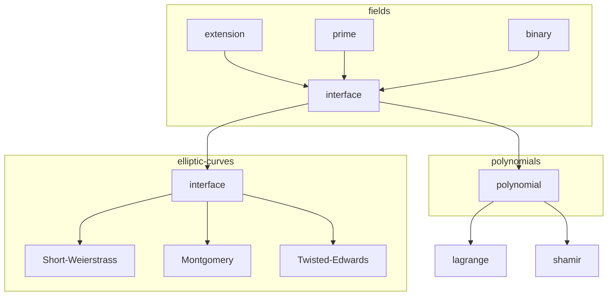

# Organization

Here we have a graph of components, describing how these components are connected.

```mermaid
graph TD
  subgraph fields
    f[interface]

    extension --> f
    prime --> f
    binary --> f
  end

  subgraph polynomials
    p[polynomial]
    f --> p
  end

  subgraph elliptic-curves
    e[interface]
    sw[Short-Weierstrass]
    mont[Montgomery]
    te[Twisted-Edwards]

    e --> sw
    e --> mont
    e --> te
    f --> e
  end

  p --> lagrange
  p -->shamir


```
